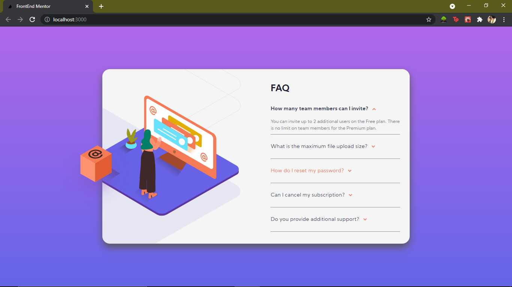

# Frontend Mentor - Stats preview card component solution

This is a solution to the [FAQ accordion card challenge on Frontend Mentor](https://www.frontendmentor.io/challenges/faq-accordion-card-XlyjD0Oam). Frontend Mentor challenges help you improve your coding skills by building realistic projects. 

## Table of contents

- [Overview](#overview)
  - [The challenge](#the-challenge)
  - [Screenshot](#screenshot)
  - [Links](#links)
- [My process](#my-process)
  - [Built with](#built-with)
  - [What I learned](#what-i-learned)
  - [Author](#author)


## Overview

Made a responsive web template using HTML, CSS and JS.

### The challenge

Users should be able to:

- View the optimal layout for the component depending on their device's screen size
- See hover states for all interactive elements on the page
- Hide/Show the answer to a question when the question is clicked

### Screenshot




### Links

- Solution URL: [github](https://github.com/masterrachit777/faq-accordion-card)
- Live Site: [Netlify](https://competent-jennings-81ac66.netlify.app/)

## My process

Built a simple website with mobile-first view, then used media queries to make it responsive for desktop. Also used Javascript and React to making it dynamic.

### Built with

- Semantic HTML5 markup
- CSS custom properties
- Flexbox
- Mobile-first workflow
- [React](https://reactjs.org/) - JS library
- ES6 Javascript

### What I learned

I learned a lot of things, like use of position and display in css.
Also learned lot of other css properties which were not known to me earlier like overflow, transform etc.
Also implemented my knowledge of React.js

```html
<h1>Some HTML code I'm proud of</h1>
```
```css
.proud-of-this-css {
  color: black;
}
```
```js
const proudOfThisFunc = () => {
  console.log('🎉')
}
```

## Author

- Frontend Mentor - [@masterrachit777](https://www.frontendmentor.io/profile/masterrachit777)
- Twitter - [@racayu1221](https://www.twitter.com/racayu1221)
